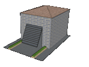

# HC-SR04_INFRARROJOS_ARDUINO

## Apertura de una puerta de garaje con un sensor de ultrasonidos y como segunda opción, apertura con mando infrarrojos.

Proyecto basado en Arduino, para abrir una puerta de garaje, la cual esta accionada por un servo motor.
Dicho servo motor es activado mediante un sensor infrarrojos o mediante un sistema de infrarrojos.

Dicho sistema infrarrojos está conformado por un mando y por una aplicación, la cual será válida cualquiera del estilo "Control_Remote_Universal".

CC BY-NC-SA 3.0 ES Alejandro Pérez

